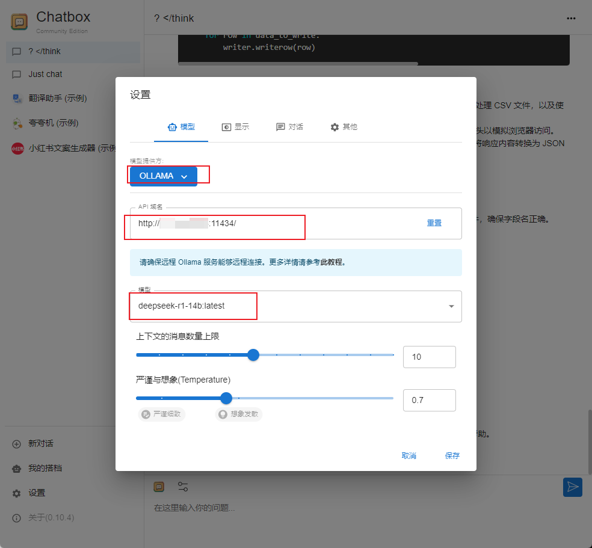

"无聊望见了犹豫, 达到理想不太易~"



# 前言

> 本文采取ollama+deepseek-r1+chatbox的形式来使用deepseek模型

# 1. ollama安装

> Ollama是一个开源工具，用于在本地轻松运行和部署大型语言模型。以下是安装Ollama的步骤：

## 1.1 **访问Ollama官网**

- [Ollama官网](https://ollama.com/download/linux)

## 1.2 **下载安装包**

- 根据你的操作系统选择对应的安装包。下载完成后，直接双击安装文件并按照提示完成安装。

## 1.3 **验证安装**

- 本文为linux服务器安装

- 在linux服务器安装完成后，设置开机启动

- 文件名：/etc/systemd/system/ollama.service

  - Description 是服务的简单描述。
  - After 指定了在哪个服务启动后启动此服务。
  - Type 定义了服务进程的启动类型，simple 表示启动主进程。
  - User 指定运行服务的用户，本文用的是root ，你也可以用其他账户。
  - WorkingDirectory 设置服务的工作目录，本文用的/root，你也可以切换成其他用户目录。
  - ExecStart 指定启动服务的命令。
    Restart 指定服务崩溃时的重启策略。
  - RestartSec 设置重启服务前等待的时间。
  - WantedBy 指定了服务所在的 target，multi-user.target 表示多用户系统。

  ```bash
  [Unit]
  Description=Ollama Service
  After=network-online.target
  
  [Service]
  ExecStart=/usr/bin/ollama serve
  User=root
  Group=root
  Restart=always
  RestartSec=3
  Environment="OLLAMA_HOST=0.0.0.0"
  Environment="OLLAMA_MODELS=/data/model/ollama"
  
  [Install]
  WantedBy=default.target
  ```

- 接下来，执行以下命令来启动服务、使服务开机自启

  ```bash
  systemctl daemon-reload
  systemctl start ollama
  systemctl enable ollama
  ```

- 安装完成后，在终端输入以下命令，检查Ollama版本

  ```bash
  ollama --version
  
  # ollama服务，默认端口为11434， 对外提供服务x.x.x.x:11434
  ```

  # 2. 下载并部署DeepSeek模型

## 2.1 选择模型

>  Ollama支持多种DeepSeek模型版本，用户可以根据硬件配置选择合适的模型。

- 本文服务器为英伟达16GB的T4显卡，因此选用**deepseek-r1:14b**模型(在线下载)

  ```bash
  ollama run deepseek-r1:14b
  ```

- 因模型过大，官网下载速度较慢，因此可以下载第三方提供的模型文件，并通过ollama离线加载模式进行加载
  - 下载完成将模型放到对应目录下，在模型文件同级目录下创建一个文件，命名为： `Modelfile`
  
    ```ini
    FROM ./deepseek-r1-distill-qwen-14b-q4_k_m.gguf
    ```
  
  - 若 `Modelfile`文件跟模型文件放在同一个目录下时，`FROM ./`后面执行的内容可以是模型的相对路径，不然为绝对路径
  
  - 进入模型所在目录，执行命令
  
    ```bash
    ollama create deepseek-r1-14b -f ./Modelfile
    ```

## 2.2 查看模型是否成功加载运行

```bash
(base) root@work03:/data/model# ollama list
NAME                      ID              SIZE      MODIFIED          
deepseek-r1-14b:latest    5adeb0e184e9    9.0 GB    About an hour ago
```

# 3. 安装chatbox

## 3.1 windows安装chatbox

- [chatbox官网](https://chatboxai.app/zh)

下载并安装对应windows版本

## 3.2 chatbox配置ollama下的deepseek-r1模型

- 按如图所示配置




